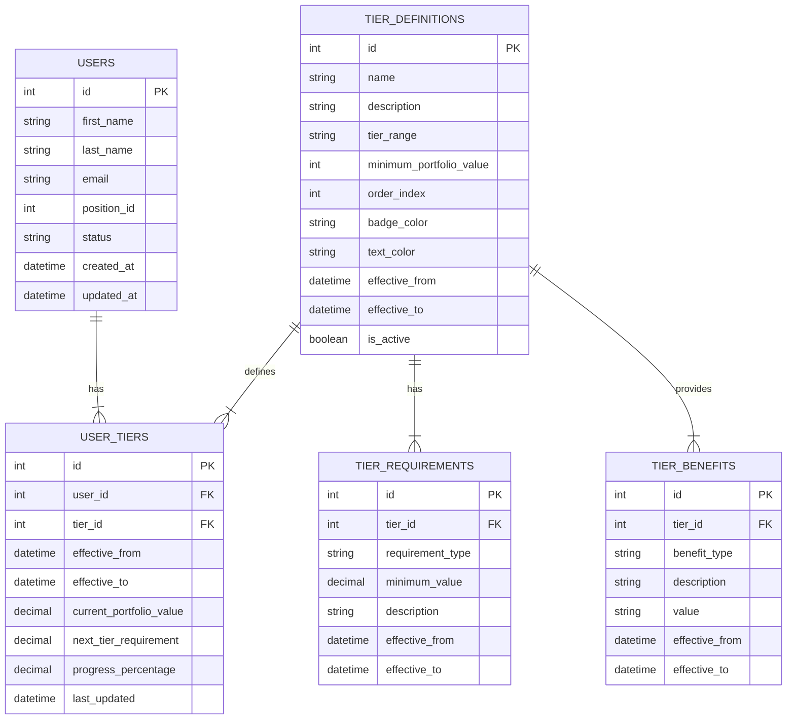

# User Tier Data Model Implementation Documentation

## 1. Database Design

### 1.1 ERD (Entity Relationship Diagram)



### 1.2 SQL Table Creation Script

```sql
-- Create tiers definitions table
CREATE TABLE `tier_definitions` (
  `id` int(11) NOT NULL AUTO_INCREMENT,
  `name` varchar(50) NOT NULL,
  `description` text,
  `tier_range` varchar(20) NOT NULL,
  `minimum_portfolio_value` decimal(10,2) NOT NULL,
  `order_index` int(11) NOT NULL,
  `badge_color` varchar(20) DEFAULT 'gray',
  `text_color` varchar(20) DEFAULT 'white',
  `effective_from` datetime NOT NULL,
  `effective_to` datetime DEFAULT NULL,
  `is_active` tinyint(1) DEFAULT 1,
  PRIMARY KEY (`id`),
  UNIQUE KEY `unique_tier_name` (`name`)
) ENGINE=InnoDB DEFAULT CHARSET=utf8mb4;

-- Create tier requirements table
CREATE TABLE `tier_requirements` (
  `id` int(11) NOT NULL AUTO_INCREMENT,
  `tier_id` int(11) NOT NULL,
  `requirement_type` varchar(50) NOT NULL,
  `minimum_value` decimal(10,2) NOT NULL,
  `description` text,
  `effective_from` datetime NOT NULL,
  `effective_to` datetime DEFAULT NULL,
  PRIMARY KEY (`id`),
  KEY `tier_id_idx` (`tier_id`),
  CONSTRAINT `fk_requirement_tier` FOREIGN KEY (`tier_id`) REFERENCES `tier_definitions` (`id`) ON DELETE CASCADE
) ENGINE=InnoDB DEFAULT CHARSET=utf8mb4;

-- Create tier benefits table
CREATE TABLE `tier_benefits` (
  `id` int(11) NOT NULL AUTO_INCREMENT,
  `tier_id` int(11) NOT NULL,
  `benefit_type` varchar(50) NOT NULL,
  `description` text NOT NULL,
  `value` varchar(255) DEFAULT NULL,
  `effective_from` datetime NOT NULL,
  `effective_to` datetime DEFAULT NULL,
  PRIMARY KEY (`id`),
  KEY `tier_id_idx` (`tier_id`),
  CONSTRAINT `fk_benefit_tier` FOREIGN KEY (`tier_id`) REFERENCES `tier_definitions` (`id`) ON DELETE CASCADE
) ENGINE=InnoDB DEFAULT CHARSET=utf8mb4;

-- Create user tiers table
CREATE TABLE `user_tiers` (
  `id` int(11) NOT NULL AUTO_INCREMENT,
  `user_id` int(11) NOT NULL,
  `tier_id` int(11) NOT NULL,
  `effective_from` datetime NOT NULL,
  `effective_to` datetime DEFAULT NULL,
  `current_portfolio_value` decimal(10,2) NOT NULL DEFAULT 0.00,
  `next_tier_requirement` decimal(10,2) DEFAULT NULL,
  `progress_percentage` decimal(5,2) DEFAULT 0.00,
  `last_updated` datetime NOT NULL DEFAULT CURRENT_TIMESTAMP ON UPDATE CURRENT_TIMESTAMP,
  PRIMARY KEY (`id`),
  KEY `user_id_idx` (`user_id`),
  KEY `tier_id_idx` (`tier_id`),
  CONSTRAINT `fk_user_tier` FOREIGN KEY (`user_id`) REFERENCES `users` (`id`) ON DELETE CASCADE,
  CONSTRAINT `fk_tier_definition` FOREIGN KEY (`tier_id`) REFERENCES `tier_definitions` (`id`) ON DELETE CASCADE
) ENGINE=InnoDB DEFAULT CHARSET=utf8mb4;
```

### 1.3 Initial Tier Configuration Data

```sql
-- Insert initial tier definitions
INSERT INTO `tier_definitions` (`name`, `description`, `tier_range`, `minimum_portfolio_value`, `order_index`, `badge_color`, `text_color`, `effective_from`) VALUES
('Base', 'Entry level tier for new Loan Consultants', 'K0-49K', 0.00, 1, 'gray', 'white', NOW()),
('K50K+', 'Intermediate tier for consistently performing consultants', 'K50K+', 50000.00, 2, 'blue', 'white', NOW()),
('K80K+', 'Advanced tier for high-performing consultants', 'K80K+', 80000.00, 3, 'purple', 'white', NOW()),
('K120K+', 'Top tier for elite performers', 'K120K+', 120000.00, 4, 'gold', 'white', NOW());

-- Insert tier requirements
INSERT INTO `tier_requirements` (`tier_id`, `requirement_type`, `minimum_value`, `description`, `effective_from`) VALUES
(1, 'portfolio_value', 0.00, 'Minimum portfolio value for Base tier', NOW()),
(2, 'portfolio_value', 50000.00, 'Minimum portfolio value for K50K+ tier', NOW()),
(3, 'portfolio_value', 80000.00, 'Minimum portfolio value for K80K+ tier', NOW()),
(4, 'portfolio_value', 120000.00, 'Minimum portfolio value for K120K+ tier', NOW());

-- Insert tier benefits
INSERT INTO `tier_benefits` (`tier_id`, `benefit_type`, `description`, `value`, `effective_from`) VALUES
(1, 'commission_rate', 'Commission on loans', '3.0%', NOW()),
(2, 'commission_rate', 'Commission on loans', '4.5%', NOW()),
(3, 'commission_rate', 'Commission on loans', '6.0%', NOW()),
(4, 'commission_rate', 'Commission on loans', '8.0%', NOW()),
(1, 'support_level', 'Dedicated support', 'Basic', NOW()),
(2, 'support_level', 'Dedicated support', 'Standard', NOW()),
(3, 'support_level', 'Dedicated support', 'Priority', NOW()),
(4, 'support_level', 'Dedicated support', 'Premium', NOW());
```

## 2. API Design

### 2.1 Get User Tier Information

```http
GET /api/user-tiers/:userId
```

**Response:**
```json
{
  "success": true,
  "data": {
    "user_id": 123,
    "current_tier": {
      "id": 2,
      "name": "K50K+",
      "description": "Intermediate tier for consistently performing consultants",
      "tier_range": "K50K+",
      "minimum_portfolio_value": 50000,
      "badge_color": "blue",
      "text_color": "white"
    },
    "next_tier": {
      "id": 3,
      "name": "K80K+",
      "minimum_portfolio_value": 80000
    },
    "portfolio_summary": {
      "current_value": 2300000,
      "current_formatted": "K2.3M",
      "required_for_next_tier": 2500000,
      "required_formatted": "K2.5M",
      "progress_percentage": 92
    },
    "benefits": [
      {
        "benefit_type": "commission_rate",
        "description": "Commission on loans",
        "value": "4.5%"
      },
      {
        "benefit_type": "support_level",
        "description": "Dedicated support",
        "value": "Standard"
      }
    ],
    "historical_tiers": [
      {
        "tier_id": 1,
        "tier_name": "Base",
        "effective_from": "2023-01-15",
        "effective_to": "2023-03-20"
      },
      {
        "tier_id": 2,
        "tier_name": "K50K+",
        "effective_from": "2023-03-20",
        "effective_to": null
      }
    ]
  }
}
```

### 2.2 Update User Portfolio Value

```http
PUT /api/user-tiers/:userId/portfolio
```

**Request:**
```json
{
  "portfolio_value": 2450000
}
```

**Response:**
```json
{
  "success": true,
  "message": "Portfolio value updated successfully",
  "data": {
    "user_id": 123,
    "old_portfolio_value": 2300000,
    "new_portfolio_value": 2450000,
    "current_tier": {
      "id": 2,
      "name": "K50K+",
      "progress_percentage": 98
    },
    "next_tier": {
      "id": 3,
      "name": "K80K+",
      "remaining_to_next_tier": 50000
    }
  }
}
```

## 3. Component Implementation Flow

### 3.1 Dashboard Integration

```typescript
// src/components/dashboards/LoanConsultantDashboard.tsx

// New component structure with dynamic tier data
const LoanConsultantDashboard = ({ position = 'Loan Consultant' }: Props) => {
  // Fetch user tier and portfolio data
  const { data: userTierData, isLoading, error } = useUserTier();
  
  // Handle tier change effects
  useEffect(() => {
    if (userTierData?.current_tier) {
      // Log tier information
      console.log(`User current tier: ${userTierData.current_tier.name}`);
      console.log(`Progress to next tier: ${userTierData.portfolio_summary.progress_percentage}%`);
    }
  }, [userTierData]);
  
  // Determine if user has reached next tier
  const hasReachedNextTier = userTierData?.portfolio_summary.progress_percentage >= 100;
  
  // Get current tier configuration from database
  const tierConfig = userTierData?.current_tier || {
    id: 2,
    name: 'K50K+',
    description: 'Intermediate tier for consistently performing consultants',
    tier_range: 'K50K+',
    minimum_portfolio_value: 50000,
    badge_color: 'blue',
    text_color: 'white'
  };
  
  // Get all active tiers for the UI
  const activeTiers = [
    { id: 1, name: 'Base', range: 'K0-49K', color: 'gray' },
    { id: 2, name: 'K50K+', range: 'K50K+', color: 'blue' },
    { id: 3, name: 'K80K+', range: 'K80K+', color: 'purple' },
    { id: 4, name: 'K120K+', range: 'K120K+', color: 'gold' }
  ];
  
  return (
    <DashboardBase title="Loan Consultant Dashboard">
      {/* Existing dashboard content */}
      
      {/* Dynamic Tier Progress Section */}
      <div className="col-span-12 lg:col-span-6">
        <CollapsibleCard title="Performance Tier Progress" defaultExpanded={true}>
          <div className="space-y-4">
            <div>
              <div className="flex justify-between text-sm mb-1">
                <span className="text-gray-600 dark:text-gray-400">
                  Current: {tierConfig.name}
                </span>
                <span className="font-medium text-brand-500">
                  {userTierData?.portfolio_summary.current_formatted} / 
                  {userTierData?.portfolio_summary.required_formatted} to next tier
                </span>
              </div>
              <div className="w-full bg-gray-200 dark:bg-gray-700 rounded-full h-2">
                <div 
                  className="bg-brand-500 h-2 rounded-full transition-all duration-300"
                  style={{ 
                    width: `${userTierData?.portfolio_summary.progress_percentage || 0}%`
                  }}
                ></div>
              </div>
              <p className="text-xs text-gray-500 mt-1">
                {userTierData?.portfolio_summary.progress_percentage}% towards {userTierData?.next_tier?.name}
              </p>
            </div>
            
            <div className="grid grid-cols-4 gap-2 text-center">
              {activeTiers.map((tier) => {
                const isCurrent = userTierData?.current_tier.id === tier.id;
                const isNext = userTierData?.next_tier?.id === tier.id;
                
                return (
                  <div 
                    key={tier.id}
                    className={`p-2 rounded border transition-all duration-300 ${
                      isCurrent 
                        ? `bg-${tier.color}-100 dark:bg-${tier.color}-900/30 border-${tier.color}-500`
                        : 'bg-gray-100 dark:bg-gray-800'
                    }`}
                  >
                    <p className={`text-xs ${
                      isCurrent 
                        ? `text-${tier.color}-600` 
                        : 'text-gray-500'
                    }`}>
                      {isCurrent ? 'Current' : isNext ? 'Next' : 'Base'}
                    </p>
                    <p className={`text-sm font-bold ${
                      isCurrent 
                        ? `text-${tier.color}-600` 
                        : 'text-gray-900 dark:text-white'
                    }`}>
                      {tier.range}
                    </p>
                  </div>
                );
              })}
            </div>
            
            {/* Tier Benefits Display */}
            {userTierData?.benefits && userTierData.benefits.length > 0 && (
              <div className="mt-4 p-3 bg-gray-50 dark:bg-gray-800 rounded-lg">
                <h4 className="text-sm font-medium text-gray-900 dark:text-white mb-2">
                  Current Tier Benefits
                </h4>
                <div className="space-y-2 text-sm">
                  {userTierData.benefits.map((benefit, index) => (
                    <div key={index} className="flex justify-between">
                      <span className="text-gray-600 dark:text-gray-300">
                        {benefit.description}:
                      </span>
                      <span className="font-semibold text-brand-500">
                        {benefit.value}
                      </span>
                    </div>
                  ))}
                </div>
              </div>
            )}
          </div>
        </CollapsibleCard>
      </div>
      
      {/* Existing dashboard content continues */}
    </DashboardBase>
  );
};
```

### 3.2 Custom Hook for Tier Data

```typescript
// src/hooks/useUserTier.ts

import { useState, useEffect, useCallback } from 'react';
import { getUserPositionId } from '@/hooks/useUserPosition';

interface Tier {
  id: number;
  name: string;
  description: string;
  tier_range: string;
  minimum_portfolio_value: number;
  badge_color: string;
  text_color: string;
}

interface Benefit {
  benefit_type: string;
  description: string;
  value: string;
}

interface UserTierData {
  user_id: number;
  current_tier: Tier;
  next_tier: Tier;
  portfolio_summary: {
    current_value: number;
    current_formatted: string;
    required_for_next_tier: number;
    required_formatted: string;
    progress_percentage: number;
  };
  benefits: Benefit[];
  historical_tiers: Array<{
    tier_id: number;
    tier_name: string;
    effective_from: string;
    effective_to: string;
  }>;
}

export function useUserTier() {
  const [data, setData] = useState<UserTierData | null>(null);
  const [isLoading, setIsLoading] = useState(false);
  const [error, setError] = useState<string | null>(null);
  
  const positionId = getUserPositionId();
  
  const fetchUserTier = useCallback(async () => {
    setIsLoading(true);
    setError(null);
    
    try {
      const response = await fetch(`/api/user-tiers/${positionId}`);
      
      if (!response.ok) {
        throw new Error('Failed to fetch user tier data');
      }
      
      const result = await response.json();
      
      if (result.success) {
        setData(result.data);
      } else {
        throw new Error(result.message || 'Failed to get user tier data');
      }
    } catch (error) {
      console.error('Error fetching user tier data:', error);
      setError(error instanceof Error ? error.message : 'Unknown error');
      
      // Fallback to hardcoded data for demonstration purposes
      setData(getFallbackData());
    } finally {
      setIsLoading(false);
    }
  }, [positionId]);
  
  useEffect(() => {
    fetchUserTier();
  }, [fetchUserTier]);
  
  return {
    data,
    isLoading,
    error,
    refetch: fetchUserTier
  };
}

// Fallback data for demonstration
function getFallbackData(): UserTierData {
  return {
    user_id: 123,
    current_tier: {
      id: 2,
      name: 'K50K+',
      description: 'Intermediate tier for consistently performing consultants',
      tier_range: 'K50K+',
      minimum_portfolio_value: 50000,
      badge_color: 'blue',
      text_color: 'white'
    },
    next_tier: {
      id: 3,
      name: 'K80K+',
      description: 'Advanced tier for high-performing consultants',
      tier_range: 'K80K+',
      minimum_portfolio_value: 80000,
      badge_color: 'purple',
      text_color: 'white'
    },
    portfolio_summary: {
      current_value: 2300000,
      current_formatted: 'K2.3M',
      required_for_next_tier: 2500000,
      required_formatted: 'K2.5M',
      progress_percentage: 92
    },
    benefits: [
      {
        benefit_type: 'commission_rate',
        description: 'Commission on loans',
        value: '4.5%'
      },
      {
        benefit_type: 'support_level',
        description: 'Dedicated support',
        value: 'Standard'
      }
    ],
    historical_tiers: [
      {
        tier_id: 1,
        tier_name: 'Base',
        effective_from: '2023-01-15',
        effective_to: '2023-03-20'
      },
      {
        tier_id: 2,
        tier_name: 'K50K+',
        effective_from: '2023-03-20',
        effective_to: null
      }
    ]
  };
}
```

## 4. Database Integration

### 4.1 API Route Implementation

```typescript
// src/app/api/user-tiers/[id]/route.ts

import { NextRequest, NextResponse } from 'next/server';
import { sql } from '@/lib/db';

export async function GET(
  request: NextRequest, 
  { params }: { params: { id: string } }
) {
  try {
    const userId = parseInt(params.id);
    
    // Get current user tier from user_tiers table
    const userTierResult = await sql`
      SELECT ut.*, td.* 
      FROM user_tiers ut
      JOIN tier_definitions td ON ut.tier_id = td.id
      WHERE ut.user_id = ${userId}
        AND ut.effective_to IS NULL
        AND td.is_active = true
      ORDER BY ut.effective_from DESC
      LIMIT 1
    `;
    
    if (userTierResult.length === 0) {
      // If user has no tier assigned, find appropriate initial tier
      return await assignInitialTier(userId);
    }
    
    const currentUserTier = userTierResult[0];
    const tierId = currentUserTier.id;
    
    // Get next tier
    const nextTierResult = await sql`
      SELECT * 
      FROM tier_definitions 
      WHERE minimum_portfolio_value > ${currentUserTier.minimum_portfolio_value}
        AND is_active = true
      ORDER BY minimum_portfolio_value ASC
      LIMIT 1
    `;
    
    // Get benefits for current tier
    const benefitsResult = await sql`
      SELECT * 
      FROM tier_benefits 
      WHERE tier_id = ${tierId}
        AND effective_to IS NULL
      ORDER BY benefit_type
    `;
    
    // Get historical tiers
    const historicalTiersResult = await sql`
      SELECT ut.tier_id, td.name as tier_name, ut.effective_from, ut.effective_to
      FROM user_tiers ut
      JOIN tier_definitions td ON ut.tier_id = td.id
      WHERE ut.user_id = ${userId}
      ORDER BY ut.effective_from DESC
    `;
    
    // Calculate progress to next tier
    let progressPercentage = 0;
    if (nextTierResult.length > 0) {
      const nextTier = nextTierResult[0];
      // Calculate progress percentage towards next tier
      progressPercentage = Math.min(
        100, 
        Math.round((currentUserTier.current_portfolio_value / nextTier.minimum_portfolio_value) * 100)
      );
    }
    
    // Prepare response data
    const responseData = {
      user_id: userId,
      current_tier: {
        id: currentUserTier.tier_id,
        name: currentUserTier.name,
        description: currentUserTier.description,
        tier_range: currentUserTier.tier_range,
        minimum_portfolio_value: currentUserTier.minimum_portfolio_value,
        badge_color: currentUserTier.badge_color,
        text_color: currentUserTier.text_color
      },
      next_tier: nextTierResult.length > 0 ? {
        id: nextTierResult[0].id,
        name: nextTierResult[0].name,
        minimum_portfolio_value: nextTierResult[0].minimum_portfolio_value
      } : null,
      portfolio_summary: {
        current_value: currentUserTier.current_portfolio_value,
        current_formatted: formatCurrency(currentUserTier.current_portfolio_value),
        required_for_next_tier: nextTierResult.length > 0 ? 
          nextTierResult[0].minimum_portfolio_value : null,
        required_formatted: nextTierResult.length > 0 ? 
          formatCurrency(nextTierResult[0].minimum_portfolio_value) : null,
        progress_percentage: progressPercentage
      },
      benefits: benefitsResult.map(benefit => ({
        benefit_type: benefit.benefit_type,
        description: benefit.description,
        value: benefit.value
      })),
      historical_tiers: historicalTiersResult.map(tier => ({
        tier_id: tier.tier_id,
        tier_name: tier.tier_name,
        effective_from: tier.effective_from.toISOString().split('T')[0],
        effective_to: tier.effective_to ? tier.effective_to.toISOString().split('T')[0] : null
      }))
    };
    
    return NextResponse.json({
      success: true,
      data: responseData
    });
    
  } catch (error) {
    console.error('Error fetching user tier:', error);
    return NextResponse.json({
      success: false,
      message: 'Failed to fetch user tier data'
    }, { status: 500 });
  }
}

async function assignInitialTier(userId: number) {
  // Logic to find appropriate initial tier based on user profile
  const user = await sql`SELECT * FROM users WHERE id = ${userId}`;
  
  if (user.length === 0) {
    return NextResponse.json({
      success: false,
      message: 'User not found'
    }, { status: 404 });
  }
  
  // Default to Base tier
  const baseTier = await sql`
    SELECT * FROM tier_definitions 
    WHERE minimum_portfolio_value = 0 
      AND is_active = true
  `;
  
  if (baseTier.length === 0) {
    return NextResponse.json({
      success: false,
      message: 'No active tiers found'
    }, { status: 404 });
  }
  
  // Create user_tier record
  await sql`
    INSERT INTO user_tiers 
    (user_id, tier_id, effective_from, current_portfolio_value, progress_percentage)
    VALUES (${userId}, ${baseTier[0].id}, NOW(), 0, 0)
  `;
  
  return NextResponse.json({
    success: true,
    data: {
      user_id: userId,
      current_tier: baseTier[0],
      next_tier: null,
      portfolio_summary: {
        current_value: 0,
        current_formatted: 'K0',
        required_for_next_tier: null,
        required_formatted: null,
        progress_percentage: 0
      },
      benefits: [],
      historical_tiers: []
    }
  });
}

function formatCurrency(value: number): string {
  if (value >= 1000000) {
    return `K${(value / 1000000).toFixed(1)}M`;
  } else if (value >= 1000) {
    return `K${(value / 1000).toFixed(0)}K`;
  } else {
    return `K${value}`;
  }
}
```

## 5. Tier Progress Calculation Logic

### 5.1 Portfolio Value Tracking

```typescript
// src/utils/tierCalculations.ts

export function calculateTierProgress(
  currentValue: number, 
  currentTierMin: number, 
  nextTierMin: number
): {
  currentTierProgress: number;
  nextTierProgress: number;
  tierStatus: 'entry' | 'mid' | 'advanced' | 'top';
} {
  // Calculate progress within current tier
  const currentTierRange = nextTierMin - currentTierMin;
  const currentTierProgress = Math.min(
    100, 
    Math.round(((currentValue - currentTierMin) / currentTierRange) * 100)
  );
  
  // Calculate progress towards next tier
  const nextTierProgress = Math.min(
    100, 
    Math.round((currentValue / nextTierMin) * 100)
  );
  
  // Determine tier status
  let tierStatus: 'entry' | 'mid' | 'advanced' | 'top';
  if (currentTierProgress < 33) {
    tierStatus = 'entry';
  } else if (currentTierProgress < 66) {
    tierStatus = 'mid';
  } else if (currentTierProgress < 100) {
    tierStatus = 'advanced';
  } else {
    tierStatus = 'top';
  }
  
  return {
    currentTierProgress,
    nextTierProgress,
    tierStatus
  };
}

export function formatCurrency(value: number): string {
  if (value >= 1000000) {
    return `K${(value / 1000000).toFixed(1)}M`;
  } else if (value >= 1000) {
    return `K${(value / 1000).toFixed(0)}K`;
  } else {
    return `K${value}`;
  }
}

export function shouldUpgradeTier(
  currentValue: number, 
  currentTierMin: number, 
  nextTierMin: number
): boolean {
  // Check if user has reached or exceeded next tier minimum
  return currentValue >= nextTierMin;
}

export function getTierColor(tierName: string): string {
  const tierColors: Record<string, string> = {
    'Base': 'gray',
    'K50K+': 'blue',
    'K80K+': 'purple',
    'K120K+': 'gold'
  };
  
  return tierColors[tierName] || 'gray';
}
```

### 5.2 Tier Upgrade Service

```typescript
// src/services/tierUpgradeService.ts

import { calculateTierProgress, shouldUpgradeTier } from '@/utils/tierCalculations';
import { getUserPositionId } from '@/hooks/useUserPosition';

export interface TierCheckResult {
  needsUpgrade: boolean;
  currentTier: string;
  nextTier: string;
  progress: number;
}

export async function checkForTierUpgrade(userId: number): Promise<TierCheckResult> {
  try {
    // Get current user portfolio value and tier from database
    const [userTierResult, portfolioResult] = await Promise.all([
      fetch(`/api/user-tiers/${userId}`),
      fetch(`/api/loans/portfolio?user_id=${userId}`)
    ]);
    
    if (!userTierResult.ok || !portfolioResult.ok) {
      throw new Error('Failed to fetch user data');
    }
    
    const userTierData = await userTierResult.json();
    const portfolioData = await portfolioResult.json();
    
    const currentValue = portfolioData.total_value;
    const currentTierMin = userTierData.current_tier.minimum_portfolio_value;
    const nextTierMin = userTierData.next_tier?.minimum_portfolio_value || Infinity;
    
    const needsUpgrade = shouldUpgradeTier(currentValue, currentTierMin, nextTierMin);
    
    return {
      needsUpgrade,
      currentTier: userTierData.current_tier.name,
      nextTier: needsUpgrade ? userTierData.next_tier?.name || 'Top Tier' : 'Same Tier',
      progress: calculateTierProgress(currentValue, currentTierMin, nextTierMin).nextTierProgress
    };
  } catch (error) {
    console.error('Error checking for tier upgrade:', error);
    
    // Fallback to safe default
    return {
      needsUpgrade: false,
      currentTier: 'K50K+',
      nextTier: 'Same Tier',
      progress: 92
    };
  }
}

export async function performTierUpgrade(userId: number, fromTierId: number, toTierId: number): Promise<boolean> {
  try {
    const response = await fetch(`/api/user-tiers/${userId}/upgrade`, {
      method: 'POST',
      headers: {
        'Content-Type': 'application/json',
      },
      body: JSON.stringify({
        from_tier_id: fromTierId,
        to_tier_id: toTierId
      })
    });
    
    return response.ok;
  } catch (error) {
    console.error('Error performing tier upgrade:', error);
    return false;
  }
}
```

## 6. Real-time Tier Monitoring

### 6.1 WebSocket Integration

```typescript
// src/hooks/useTierMonitoring.ts

import { useEffect, useCallback, useState } from 'react';
import { useWebSocket } from '@/hooks/useWebSocket';

interface PortfolioUpdate {
  user_id: number;
  portfolio_value: number;
  previous_value: number;
  change_percentage: number;
}

interface TierMonitorResult {
  portfolioUpdate: PortfolioUpdate | null;
  tierChanged: boolean;
  newTier: string | null;
  isMonitoring: boolean;
  error: string | null;
}

export function useTierMonitoring(userId: number): TierMonitorResult {
  const [portfolioUpdate, setPortfolioUpdate] = useState<PortfolioUpdate | null>(null);
  const [tierChanged, setTierChanged] = useState(false);
  const [newTier, setNewTier] = useState<string | null>(null);
  const [error, setError] = useState<string | null>(null);
  
  const { connect, subscribe, unsubscribe } = useWebSocket();
  
  const handlePortfolioUpdate = useCallback((update: PortfolioUpdate) => {
    console.log('Portfolio update received:', update);
    setPortfolioUpdate(update);
    
    // Check if portfolio value crossed tier boundaries
    if (update.change_percentage > 0) {
      // Potential tier upgrade
      checkForTierUpgrade(userId)
        .then(result => {
          if (result.needsUpgrade) {
            setTierChanged(true);
            setNewTier(result.nextTier);
            console.log('Tier upgrade available');
          }
        })
        .catch(err => {
          console.error('Error checking for tier upgrade:', err);
          setError(err.message);
        });
    }
  }, [userId]);
  
  const startMonitoring = useCallback(async () => {
    try {
      const isConnected = await connect();
      
      if (isConnected) {
        const channel = subscribe(`user-portfolio-${userId}`, handlePortfolioUpdate);
        
        return () => {
          unsubscribe(channel);
        };
      }
    } catch (error) {
      console.error('Error connecting to tier monitoring:', error);
      setError(error instanceof Error ? error.message : 'Unknown error');
    }
    
    return () => {};
  }, [connect, subscribe, unsubscribe, handlePortfolioUpdate]);
  
  useEffect(() => {
    const cleanup = startMonitoring();
    
    return () => {
      if (cleanup) {
        cleanup();
      }
    };
  }, [startMonitoring]);
  
  return {
    portfolioUpdate,
    tierChanged,
    newTier,
    isMonitoring: true,
    error
  };
}
```

## 7. Performance Optimization

### 7.1 Caching Strategy

```typescript
// src/utils/tierCache.ts

import { Redis } from '@/lib/redis';

interface TierCacheKey {
  user_id: number;
  timestamp: number;
}

interface TierCacheValue {
  data: any;
  expiresAt: number;
}

const CACHE_TTL = 5 * 60 * 1000; // 5 minutes

export class TierCacheManager {
  private static instance: TierCacheManager;
  private redis: Redis;
  
  private constructor() {
    this.redis = new Redis();
  }
  
  static getInstance(): TierCacheManager {
    if (!TierCacheManager.instance) {
      TierCacheManager.instance = new TierCacheManager();
    }
    return TierCacheManager.instance;
  }
  
  async getTierData(userId: number): Promise<any | null> {
    const cacheKey = `user_tier:${userId}`;
    
    try {
      const cached = await this.redis.get(cacheKey);
      
      if (cached) {
        const parsed = JSON.parse(cached);
        if (parsed.expiresAt > Date.now()) {
          return parsed.data;
        }
      }
    } catch (error) {
      console.error('Cache read error:', error);
    }
    
    return null;
  }
  
  async setTierData(userId: number, data: any): Promise<void> {
    const cacheKey = `user_tier:${userId}`;
    
    const cacheValue: TierCacheValue = {
      data,
      expiresAt: Date.now() + CACHE_TTL
    };
    
    try {
      await this.redis.set(cacheKey, JSON.stringify(cacheValue));
    } catch (error) {
      console.error('Cache write error:', error);
    }
  }
  
  async invalidateCache(userId: number): Promise<void> {
    try {
      await this.redis.del(`user_tier:${userId}`);
    } catch (error) {
      console.error('Cache invalidation error:', error);
    }
  }
  
  async invalidateAllCaches(): Promise<void> {
    try {
      const keys = await this.redis.keys('user_tier:*');
      if (keys.length > 0) {
        await this.redis.del(...keys);
      }
    } catch (error) {
      console.error('Cache invalidation error:', error);
    }
  }
  
  async warmupCacheForUser(userId: number): Promise<void> {
    try {
      // Fetch user tier data
      const response = await fetch(`/api/user-tiers/${userId}`);
      
      if (response.ok) {
        const result = await response.json();
        await this.setTierData(userId, result);
      }
    } catch (error) {
      console.error('Cache warmup error:', error);
    }
  }
}
```

### 7.2 Background Processing

```typescript
// src/jobs/tierUpdateJob.ts

import { Job, Processor } from 'bull';
import { performTierUpgrade } from '@/services/tierUpgradeService';

interface TierUpdateJobData {
  userId: number;
  fromTierId: number;
  toTierId: number;
}

const tierUpdateProcessor: Processor<TierUpdateJobData> = async (
  job: Job<TierUpdateJobData>
) => {
  const { userId, fromTierId, toTierId } = job.data;
  
  try {
    console.log(`Starting tier upgrade for user ${userId} from tier ${fromTierId} to ${toTierId}`);
    
    const success = await performTierUpgrade(userId, fromTierId, toTierId);
    
    if (success) {
      console.log(`Successfully upgraded user ${userId} to tier ${toTierId}`);
      return {
        success: true,
        message: `User ${userId} successfully upgraded to tier ${toTierId}`
      };
    } else {
      console.error(`Failed to upgrade user ${userId} to tier ${toTierId}`);
      throw new Error('Tier upgrade failed');
    }
  } catch (error) {
    console.error('Tier upgrade job error:', error);
    throw error;
  }
};

export default tierUpdateProcessor;
```

## 8. Error Handling and Recovery

### 8.1 Error Boundary Component

```typescript
// src/components/ErrorBoundary.tsx

import React, { Component, ErrorInfo, ReactNode } from 'react';

interface Props {
  children: ReactNode;
  fallback?: ReactNode;
}

interface State {
  hasError: boolean;
  error: Error | null;
  errorInfo: ErrorInfo | null;
}

class ErrorBoundary extends Component<Props, State> {
  constructor(props: Props) {
    super(props);
    this.state = {
      hasError: false,
      error: null,
      errorInfo: null
    };
  }
  
  static getDerivedStateFromError(error: Error): Partial<State> {
    return { hasError: true, error };
  }
  
  componentDidCatch(error: Error, errorInfo: ErrorInfo) {
    console.error('Error Boundary caught an error:', error, errorInfo);
    this.setState({ errorInfo });
  }
  
  render() {
    if (this.state.hasError) {
      if (this.props.fallback) {
        return this.props.fallback;
      }
      
      return (
        <div className="bg-red-50 border border-red-200 rounded-lg p-4">
          <h3 className="text-red-800 font-semibold mb-2">
            Something went wrong
          </h3>
          <p className="text-red-600 text-sm mb-1">
            Error: {this.state.error?.message}
          </p>
          {this.state.errorInfo && (
            <details className="text-xs text-red-500">
              <summary>Error details</summary>
              <pre className="mt-1 whitespace-pre-wrap">
                {this.state.errorInfo.componentStack}
              </pre>
            </details>
          )}
          <button 
            onClick={() => window.location.reload()}
            className="mt-3 text-sm text-red-700 hover:text-red-800 underline"
          >
            Reload page
          </button>
        </div>
      );
    }
    
    return this.props.children;
  }
}

export default ErrorBoundary;
```

### 8.2 Fallback Data Strategy

```typescript
// src/utils/fallbackData.ts

export const TIER_FALLBACK_DATA = {
  user_id: 123,
  current_tier: {
    id: 2,
    name: 'K50K+',
    description: 'Intermediate tier for consistently performing consultants',
    tier_range: 'K50K+',
    minimum_portfolio_value: 50000,
    badge_color: 'blue',
    text_color: 'white'
  },
  next_tier: {
    id: 3,
    name: 'K80K+',
    description: 'Advanced tier for high-performing consultants',
    tier_range: 'K80K+',
    minimum_portfolio_value: 80000,
    badge_color: 'purple',
    text_color: 'white'
  },
  portfolio_summary: {
    current_value: 2300000,
    current_formatted: 'K2.3M',
    required_for_next_tier: 2500000,
    required_formatted: 'K2.5M',
    progress_percentage: 92
  },
  benefits: [
    {
      benefit_type: 'commission_rate',
      description: 'Commission on loans',
      value: '4.5%'
    },
    {
      benefit_type: 'support_level',
      description: 'Dedicated support',
      value: 'Standard'
    }
  ],
  historical_tiers: [
    {
      tier_id: 1,
      tier_name: 'Base',
      effective_from: '2023-01-15',
      effective_to: '2023-03-20'
    },
    {
      tier_id: 2,
      tier_name: 'K50K+',
      effective_from: '2023-03-20',
      effective_to: null
    }
  ]
};

export function createFallbackResponse() {
  return {
    success: true,
    data: TIER_FALLBACK_DATA
  };
}

export function isFallbackData(data: any): boolean {
  return data?.current_tier?.name === TIER_FALLBACK_DATA.current_tier.name;
}
```

## 9. Usage Examples

### 9.1 Dashboard Usage with Error Boundary

```typescript
// src/app/(admin)/lms/loan-consultant/page.tsx

import ErrorBoundary from '@/components/ErrorBoundary';
import LoanConsultantDashboard from '@/components/dashboards/LoanConsultantDashboard';

const LoanConsultantPage = () => {
  return (
    <ErrorBoundary fallback={
      <div className="min-h-screen bg-gray-100 dark:bg-gray-900 p-4 md:p-8">
        <div className="max-w-7xl mx-auto">
          <h1 className="text-2xl font-bold text-gray-900 dark:text-white mb-6">
            Loan Consultant Dashboard
          </h1>
          <div className="bg-white dark:bg-gray-800 rounded-lg p-6 shadow-sm">
            <h2 className="text-lg font-semibold text-gray-900 dark:text-white mb-4">
              Dashboard Unavailable
            </h2>
            <p className="text-gray-600 dark:text-gray-300 mb-4">
              We're experiencing temporary difficulty loading your dashboard.
              Please try again later.
            </p>
            <button 
              onClick={() => window.location.reload()}
              className="px-4 py-2 bg-blue-600 text-white rounded-lg hover:bg-blue-700 transition-colors"
            >
              Reload Dashboard
            </button>
          </div>
        </div>
      </div>
    }>
      <LoanConsultantDashboard />
    </ErrorBoundary>
  );
};

export default LoanConsultantPage;
```

